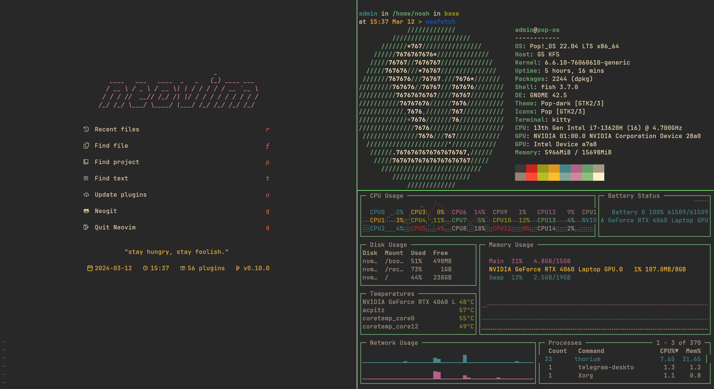

# My dotfiles

 

## Installing

You will need `git` and GNU `stow`
Clone into your `$HOME` directory or `~`
```bash
git clone https://github.com/popshia/dotfiles ~
```
Run `stow` to symlink everything or just select what you want
```bash
stow --target=${HOME} */ # Everything (the '/' ignores the README)
```
or
```bash
stow --target=${HOME} fish # Just my fish config
```
## Stuffs I've been using

- terminal: [kitty (minimum version 0.31.0)](https://github.com/kovidgoyal/kitty)
- editor: [neovim (my nvim config repo)](https://github.com/popshia/nvim)
- shell: [fish (minimum version: 3.4.0)](https://github.com/fish-shell/fish-shell)
- shell prompt: [starship](https://github.com/starship/starship)
- activity monitor: [starship](https://github.com/starship/starship)
- fuzzy finding: [fzf (minimum version: 0.33.0)](https://github.com/junegunn/fzf)
- file finding: [fd (minimum version: 8.5.0)](https://github.com/sharkdp/fd)
- file previewing: [bat (minimum version: 0.16.0)](https://github.com/sharkdp/bat)
- font: [NerdFont (JetBrainsMono)](https://github.com/ryanoasis/nerd-fonts)
- linux key-remapping: [xmodmap](https://wiki.archlinux.org/title/xmodmap)
- mac keyboard shortcuts: [hammerspoon](https://github.com/Hammerspoon/hammerspoon)
