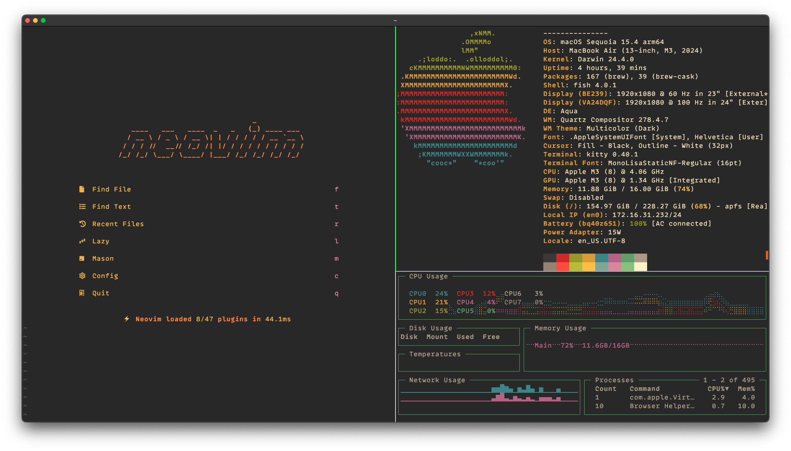

# Dotfiles

A comprehensive collection of configuration files for my development environment across Linux and macOS systems.



## Overview

This repository contains my personal dotfiles for various tools and applications I use daily. It's organized to work with GNU Stow, which creates symlinks from this repository to your home directory, making it easy to manage and version control your configurations.

## Features

- Cross-platform support (Linux and macOS)
- Modular organization with stow
- Detailed setup instructions for different environments
- Optimized configurations for terminal-based workflow
- Keyboard-centric UI enhancements

## Prerequisites

- `git` for cloning the repository
- GNU `stow` for creating symlinks
- Recommended tools listed below (can be installed separately)

## Installation

### Basic Setup

1. Clone this repository to your home directory:
   ```bash
   git clone https://github.com/popshia/dotfiles ~/.dotfiles
   cd ~/.dotfiles
   ```

2. Use stow to symlink configurations:
   ```bash
   # Symlink everything (the '/' ignores the README and other non-config files)
   stow --target=${HOME} */

   # Or symlink specific configurations
   stow --target=${HOME} fish kitty starship
   ```

## Configuration Details

### Shell Environment (Fish)
- Modern shell with smart autocompletions
- Custom prompt via Starship
- Useful aliases and functions
- Integration with tools like fzf, zoxide, and eza

### Terminal (Kitty)
- GPU-accelerated terminal emulator
- Custom keybindings and themes
- Split panes and tabs support

### Editor
- Neovim configuration available at [popshia/nvim](https://github.com/popshia/nvim)

### Keyboard Customization
- Linux: xmodmap and input-remapper
- macOS: Hammerspoon and Karabiner
- Windows: AutoHotkeys

## Core Tools

| Category | Tool | Description | Minimum Version |
|----------|------|-------------|----------------|
| Terminal | [kitty](https://github.com/kovidgoyal/kitty) | GPU-based terminal emulator | 0.31.0 |
| Editor | [neovim](https://github.com/popshia/nvim) | Modern vim-based editor | - |
| Shell | [fish](https://github.com/fish-shell/fish-shell) | User-friendly shell | 3.4.0 |
| Shell Prompt | [starship](https://github.com/starship/starship) | Customizable prompt | - |
| File Management | [ranger](https://github.com/ranger/ranger) | Terminal file browser | - |
| File Management | [yazi](https://github.com/sxyazi/yazi) | Modern file manager | - |
| Search | [fzf](https://github.com/junegunn/fzf) | Fuzzy finder | 0.33.0 |
| Search | [fd](https://github.com/sharkdp/fd) | Alternative to `find` | 8.5.0 |
| Viewing | [bat](https://github.com/sharkdp/bat) | Enhanced `cat` | 0.16.0 |
| System | [gotop](https://github.com/xxxserxxx/gotop) | Terminal activity monitor | - |
| Font | [JetBrainsMono Nerd Font](https://github.com/ryanoasis/nerd-fonts) | Patched font with icons | - |

## Platform-Specific Tools

### Linux
- [xmodmap](https://wiki.archlinux.org/title/xmodmap) - Key remapping
- [input-remapper](https://github.com/sezanzeb/input-remapper) - Input device remapping

### macOS
- [hammerspoon](https://github.com/Hammerspoon/hammerspoon) - Automation tool
- [karabiner](https://github.com/pqrs-org/Karabiner-Elements) - Keyboard customization

### Windows
- [autohotkeys](https://www.autohotkey.com/) - Automation scripting

## Additional Utilities
- [zoxide](https://github.com/ajeetdsouza/zoxide) - Smarter cd command
- [eza](https://github.com/eza-community/eza) - Modern ls replacement
- [vivid](https://github.com/sharkdp/vivid) - LS_COLORS generator
- [lazygit](https://github.com/jesseduffield/lazygit) - Terminal UI for git
- [git-delta](https://github.com/dandavison/delta) - Better git diffs

## Customization

Feel free to fork this repository and customize it to your needs. The modular structure makes it easy to add or remove configurations as needed.
